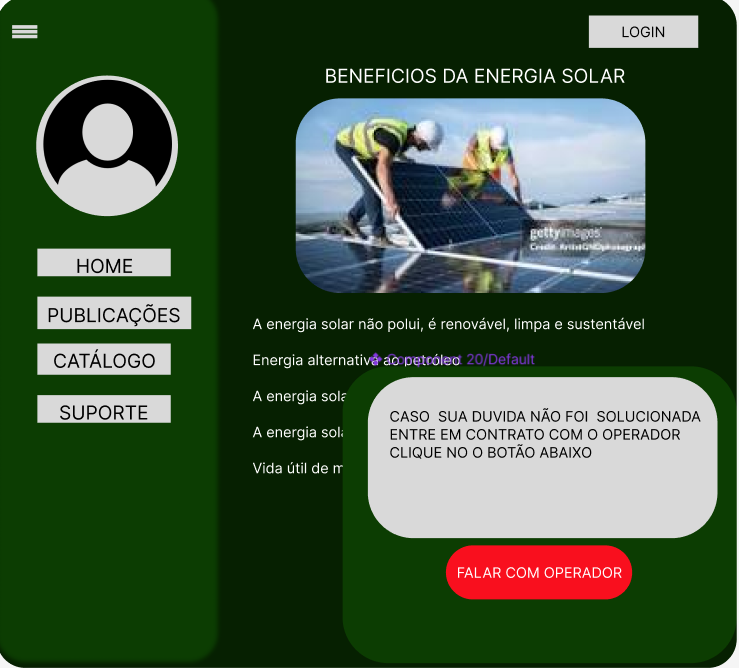

## 4. Projeto da Solução

O projeto de solução para o site de catálogo de empresas de energia solar é voltado para conectar clientes interessados em instalar sistemas de energia solar a empresas que prestam esse serviço, simplificando a busca e o acesso a informações sobre fornecedores. A arquitetura da aplicação é baseada em uma estrutura de front-end e back-end. O front-end é desenvolvido com HTML, CSS, JavaScript e Bootstrap, proporcionando uma interface amigável, moderna e responsiva, capaz de se adaptar a diferentes dispositivos. O uso do Bootstrap facilita a criação de componentes visuais elegantes e consistentes, permitindo um desenvolvimento mais ágil da interface.

No back-end, é utilizado Node.js com o framework Express e o banco de dados MySQL para gerenciar a lógica de negócios e o armazenamento de dados. O Express permite a criação de rotas e APIs RESTful de forma eficiente, facilitando a comunicação entre o cliente e o servidor, enquanto o MySQL é responsável pelo armazenamento seguro e organizado das informações das empresas, suas localizações, especialidades, e detalhes sobre serviços e preços. Essa combinação de tecnologias garante um desempenho robusto e escalável, permitindo que o sistema suporte um grande número de usuários e consultas simultâneas.

O site oferece um sistema de cadastro para empresas, onde elas podem atualizar seus perfis e serviços, e para clientes, que podem salvar empresas favoritas e realizar comparações. A modelagem de dados foi projetada para garantir relacionamentos claros entre entidades como Empresas, Serviços, Localizações e Avaliações, garantindo uma busca eficiente e organizada. A comunicação entre o navegador do usuário e o servidor é segura e eficiente, garantindo a integridade e a segurança das informações armazenadas.

Com essa estrutura, o sistema busca oferecer uma experiência de navegação intuitiva e prática, ajudando os usuários a encontrar empresas de energia solar de forma rápida e confiável, com ênfase na acessibilidade e na eficiência.

## 4.1. Arquitetura da solução

O sistema é montado em uma estrutura simples de cliente e servidor onde existe o frontend responsável por apresentar a interface do usuário através do HTML, CSS, Bootstrap e JavaScript. Interações do usuário podem incluir: Conversar e usar o chatbot, pedir por recomendações de empresas, enviar feedback sobre funcionalidades no sistema e se cadastrar como empresa parceira. Em cada interação acontece o envio de requisições do frontend para a API RESTful do backend utilizando a estrutura JSON.

O backend composto pelo NodeJS com Express e MySQL, responsáveis pelo servidor e API RESTful, recebe estes envios e processa eles, determinando o que deve ser feito em cada uma das situações. Em uma situação de chatbot o backend iria determinar a resposta mais eficiente ou iria encaminhar a conversa para um atendente, e, em uma situação de entrega de feedback o backend iria armazenar os dados no MySQL.

No banco de dados relacional MySQL são armazenados os dados de cada um destes processos de forma organizada, para que possam ser feitas outras consultas e uso dos dados para o bom funcionamento da plataforma. Em uma situação onde o cliente pede por recomendações de empresas parceiras por exemplo o backend acessa o banco de dados para verificar quais são as empresas parceiras existentes e quais delas são mais adequadas segundo o pedido do cliente, então é enviado uma resposta para o frontend para que ela seja usada e visualizada pelo cliente.

### 4.2. Protótipos de telas

Tela da Homepage

Tela do Chat Automatizado

Tela da opção dada pelo chat automatizado

Tela de um atendente falando no chat automatizado

Tela do formulário de entrega de feedback

Tela do formulário de cadastro de empresas parceiras

Tela do formulário de busca por empresas parceiras

Tela da lista de empresas parceiras

## Diagrama de Classes

O diagrama de classes ilustra graficamente como será a estrutura do software, e como cada uma das classes da sua estrutura estarão interligadas. Essas classes servem de modelo para materializar os objetos que executarão na memória.

As referências abaixo irão auxiliá-lo na geração do artefato “Diagrama de Classes”.

> - [Diagramas de Classes - Documentação da IBM](https://www.ibm.com/docs/pt-br/rational-soft-arch/9.6.1?topic=diagrams-class)
> - [O que é um diagrama de classe UML? | Lucidchart](https://www.lucidchart.com/pages/pt/o-que-e-diagrama-de-classe-uml)

## Modelo ER

### 4.3. Modelo de dados

#### 4.3.1 Modelo ER

---

#### 4.3.2 Esquema Relacional

---

#### 4.3.3 Modelo Físico

<code>

 CREATE TABLE Cliente (
    IDCliente INTEGER PRIMARY KEY,
    Email VARCHAR(35),
    Telefone VARCHAR(20),
    Endereco VARCHAR(60),
    Nome VARCHAR(40),
    fk_Empresa_CNPJ_Empresa VARCHAR(14)
);

CREATE TABLE Administrador (
    fk_Funcionario_CPF VARCHAR(12) PRIMARY KEY,
    fk_Empresa_CNPJ_Empresa VARCHAR(14)
);

CREATE TABLE Suporte_ao_Cliente (
    fk_Funcionario_CPF VARCHAR(12) PRIMARY KEY
);

CREATE TABLE Gerente_de_Conteudo (
    fk_Funcionario_CPF VARCHAR(12) PRIMARY KEY
);

CREATE TABLE EmpresasParceiras (
    CNPJ VARCHAR(14) PRIMARY KEY,
    Nome VARCHAR(40),
    Endereco VARCHAR(60),
    Telefone VARCHAR(20),
    fk_Empresa_CNPJ_Empresa VARCHAR(14)
);

CREATE TABLE Funcionario (
    CPF VARCHAR(12) PRIMARY KEY,
    Nome VARCHAR(40),
    Telefone VARCHAR(20),
    Endereco VARCHAR(60),
    Email VARCHAR(35),
    fk_Empresa_CNPJ_Empresa VARCHAR(14)
);

CREATE TABLE Empresa (
    CNPJ_Empresa VARCHAR(14) PRIMARY KEY,
    Nome VARCHAR (40)
);

CREATE TABLE Conteudo (
    IDConteudo INTEGER PRIMARY KEY,
    Nome VARCHAR(70)
);

CREATE TABLE Atendimento_Atende (
    Protocolo INTEGER PRIMARY KEY,
    Data DATE,
    fk_Suporte_ao_Cliente_fk_Funcionario_CPF VARCHAR(12),
    fk_Cliente_IDCliente INTEGER
);

CREATE TABLE Procura (
    fk_Cliente_IDCliente INTEGER,
    fk_EmpresasParceiras_CNPJ VARCHAR(14)
);

CREATE TABLE Gerencia (
    fk_Conteudo_IDConteudo INTEGER,
    fk_Gerente_de_Conteudo_fk_Funcionario_CPF VARCHAR(12)
);

CREATE TABLE Visualiza (
    fk_Cliente_IDCliente INTEGER,
    fk_Conteudo_IDConteudo INTEGER
);
 
ALTER TABLE Cliente ADD CONSTRAINT FK_Cliente_2
    FOREIGN KEY (fk_Empresa_CNPJ_Empresa)
    REFERENCES Empresa (CNPJ_Empresa)
    ON DELETE CASCADE;
 
ALTER TABLE Administrador ADD CONSTRAINT FK_Administrador_2
    FOREIGN KEY (fk_Funcionario_CPF)
    REFERENCES Funcionario (CPF)
    ON DELETE CASCADE;
 
ALTER TABLE Administrador ADD CONSTRAINT FK_Administrador_3
    FOREIGN KEY (fk_Empresa_CNPJ_Empresa)
    REFERENCES Empresa (CNPJ_Empresa)
    ON DELETE RESTRICT;
 
ALTER TABLE Suporte_ao_Cliente ADD CONSTRAINT FK_Suporte_ao_Cliente_2
    FOREIGN KEY (fk_Funcionario_CPF)
    REFERENCES Funcionario (CPF)
    ON DELETE CASCADE;
 
ALTER TABLE Gerente_de_Conteudo ADD CONSTRAINT FK_Gerente_de_Conteudo_2
    FOREIGN KEY (fk_Funcionario_CPF)
    REFERENCES Funcionario (CPF)
    ON DELETE CASCADE;
 
ALTER TABLE EmpresasParceiras ADD CONSTRAINT FK_EmpresasParceiras_2
    FOREIGN KEY (fk_Empresa_CNPJ_Empresa)
    REFERENCES Empresa (CNPJ_Empresa)
    ON DELETE CASCADE;
 
ALTER TABLE Funcionario ADD CONSTRAINT FK_Funcionario_2
    FOREIGN KEY (fk_Empresa_CNPJ_Empresa)
    REFERENCES Empresa (CNPJ_Empresa)
    ON DELETE RESTRICT;
 
ALTER TABLE Atendimento_Atende ADD CONSTRAINT FK_Atendimento_Atende_2
    FOREIGN KEY (fk_Suporte_ao_Cliente_fk_Funcionario_CPF)
    REFERENCES Suporte_ao_Cliente (fk_Funcionario_CPF);
 
ALTER TABLE Atendimento_Atende ADD CONSTRAINT FK_Atendimento_Atende_3
    FOREIGN KEY (fk_Cliente_IDCliente)
    REFERENCES Cliente (IDCliente);
 
ALTER TABLE Procura ADD CONSTRAINT FK_Procura_1
    FOREIGN KEY (fk_Cliente_IDCliente)
    REFERENCES Cliente (IDCliente)
    ON DELETE SET NULL;
 
ALTER TABLE Procura ADD CONSTRAINT FK_Procura_2
    FOREIGN KEY (fk_EmpresasParceiras_CNPJ)
    REFERENCES EmpresasParceiras (CNPJ)
    ON DELETE SET NULL;
 
ALTER TABLE Gerencia ADD CONSTRAINT FK_Gerencia_1
    FOREIGN KEY (fk_Conteudo_IDConteudo)
    REFERENCES Conteudo (IDConteudo)
    ON DELETE RESTRICT;
 
ALTER TABLE Gerencia ADD CONSTRAINT FK_Gerencia_2
    FOREIGN KEY (fk_Gerente_de_Conteudo_fk_Funcionario_CPF)
    REFERENCES Gerente_de_Conteudo (fk_Funcionario_CPF)
    ON DELETE SET NULL;
 
ALTER TABLE Visualiza ADD CONSTRAINT FK_Visualiza_1
    FOREIGN KEY (fk_Cliente_IDCliente)
    REFERENCES Cliente (IDCliente)
    ON DELETE SET NULL;
 
ALTER TABLE Visualiza ADD CONSTRAINT FK_Visualiza_2
    FOREIGN KEY (fk_Conteudo_IDConteudo)
    REFERENCES Conteudo (IDConteudo)
    ON DELETE SET NULL;

</code>

### 4.4. Tecnologias

**Frontend:**
Foi selecionado HTML, CSS e JavaScript para compor o frontend, serão usados para estruturar, estilizar e criar toda a interação na interface do usuário. O Framework Bootstrap foi escolhido para facilitar e criar uma interface responsiva na plataforma.

**Backend:**
Node.js com Express foi escolhido para construir uma API RESTful que receberá e processará as requisições que vierem do frontend, a razão desta escolha foi a facilidade de encontrar tutoriais e documentações para estes componentes além de terem os recursos necessários para um backend funcional.
com o pacote MySQL para o Node.js será integrado o banco de dados relacional com o backend, permitindo o controle sobre os dados.

**Banco de dados:**
Será utilizado o banco de dados relacional MySql para armazenar todos os dados, como feedback, empresas parceiras e conteúdos de forma estruturada e organizada, de forma a permitir a utilização destes dados de forma simples na plataforma através de sua disponibilidade de utilização no NodeJS

**Ferramentas:**
Visual Studio Code será utilizado para o desenvolvimento da plataforma e gerenciamento de seu código por razão de haver grande documentação disponível para aprendizado desta ferramenta, além de ter muitas funcionalidades e ser uma ferramenta popular.
Postman é a ferramenta escolhida para revisar APIs e verificar a sua integridade e funcionamento, também é uma ferramenta considerada popular e intuitiva de usar, facilitando os testes e acelerando o desenvolvimento.
Git e GitHub serão usados para controle de versão do código da plataforma

O usuário usa a plataforma por meio de um navegador, usando uma interface criada a partir de HTML, CSS, BootStrap e JavaScript. Quando o usuário solicita alguma coisa, por exemplo, pede recomendações de empresa ou preenche e envia um formulário, a interface envia requisições para a API RESTful que funciona através do NodeJS com Express, que por sua vez realiza consultas no banco de dados MySQL para buscar ou salvar informações, como por exemplo algum feedback. O Backend processa o pedido e envia respostas de volta para o frontend. O banco de dados MySQL por sua vez armazena os dados de forma organizada e estruturada em tabelas relacionadas, a conexão com o Backend é feita através do driver MySQL feito para NodeJS

| **Dimensão**   | **Tecnologia**  |
| ---            | ---             |
| SGBD           | MySQL           |
| Front end      | HTML+CSS+JS+BootStrap     |
| Back end       | Java NodeJS+Express+MySQL |
| Deploy         | Github    |

