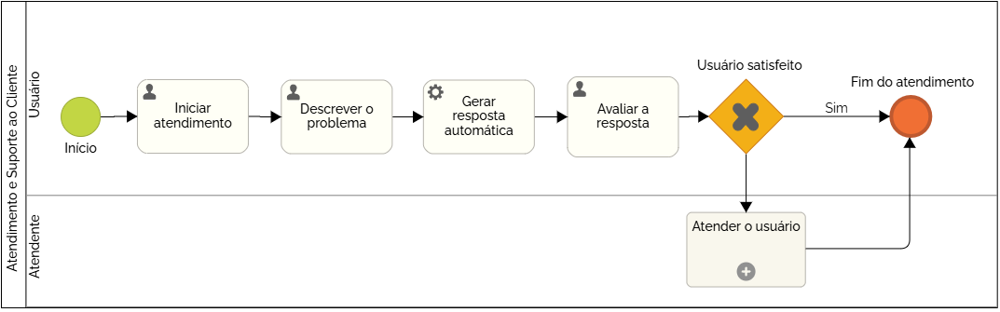

### 3.3.1 Processo 1 – Atendimento e Suporte ao Cliente

_Apresente aqui o nome e as oportunidades de melhoria para o processo 1. 
Em seguida, apresente o modelo do processo 1, descrito no padrão BPMN._

#### Detalhamento das atividades

**Atividade 1 - Iniciar atendimento**

O processo de atendimento e suporte ao cliente se inicia com o usuário criando um novo atendimento através de um chat automatizado disponível através de um botão na plataforma

| **Comandos**         |  **Destino**                   | **Tipo** |
| ---                  | ---                            | ---               |
| Abrir chat automatizado | Tornar visível chat na tela  | Default |

**Atividade 2 - Descrever o problema**

O usuário irá descrever o problema ou situação o qual ele necessita de ajuda e então irá enviar a mensagem para o chatbot.

| **Campo**       | **Tipo**         | **Restrições** | **Valor default** |
| ---             | ---              | ---            | ---               |
| Descrição do problema | Área de Texto  |  Mínimo 15 caracteres, Máximo 500 caracteres              |                   |

| **Comandos**         |  **Destino**                   | **Tipo**          |
| ---                  | ---                            | ---               |
| Enviar mensagem | Mensagem para o chat automatizado  | Default |

O chat automatizado então irá verificar nos materiais disponíveis por uma resposta e irá disponibilizar a resposta que mais se adequar ao problema do usuário. Irá então perguntar se esta resposta satisfaz o usuário.

**Atividade 3 - Avaliar a resposta**

O usuário irá analisar a resposta recebida e caso ela o satisfaça o processo irá terminar.
Caso ele não esteja satisfeito poderá continuar o atendimento ao responder que a resposta não o satisfaz, neste caso o chat automatizado irá enviar o problema para um atendente que irá atender o usuário e após isto o processo irá terminar.

| **Campo**       | **Tipo**         | **Restrições** | **Valor default** |
| ---             | ---              | ---            | ---               |
| Resposta me satisfaz | Seleção única  |  Opções Sim ou Não              |                   |

| **Comandos**         |  **Destino**                   | **Tipo**          |
| ---                  | ---                            | ---               |
| Enviar resposta | Mensagem para o chat automatizado  | Default |
