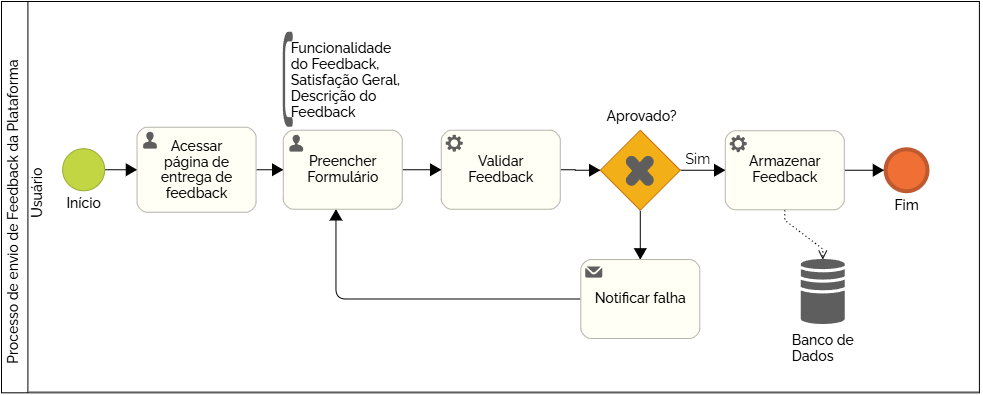

### 3.3.2 Processo 2 – Envio de Feedback na Plataforma

_Apresente aqui o nome e as oportunidades de melhoria para o processo 1. 
Em seguida, apresente o modelo do processo 1, descrito no padrão BPMN._

#### Detalhamento das atividades

**Atividade 1 - Acessar página de entrega de feedback**

O processo de envio de feedback da plataforma se inicia com o usuário indo até a página onde é preenchido e entregue os feedbacks da plataforma

| **Comandos**         |  **Destino**                   | **Tipo** |
| ---                  | ---                            | ---               |
| Visitar página de Feedback | Ir para a página de feedback  | Default |

**Atividade 2 - Preencher Formulário**

O usuário preencherá um formulário mencionando quais funcionalidades o feedback diz a respeito, a sua satisfação geral com estas funcionalidades e a descrição completa do feedback. Será validado o feedback do usuário em tempo real caso tenha deixado algum campo com informações inválidas. Ele será avisado e terá que corrigir estes campos para enviar o feedback. Após o envio o processo terminará.

| **Campo**       | **Tipo**         | **Restrições** | **Valor default** |
| ---             | ---              | ---            | ---               |
| Funcionalidade direcionada | Caixa de Texto  |  Mínimo 10 caracteres, Máximo 40 caracteres              |                   |
| Satisfação Geral | Seleção única  |    Opções de 0 a 5            |                   |
| Descrição do Feedback | Área de Texto  |   Mínimo 30 caracteres, Máximo 400 caracteres             |                   |

| **Comandos**         |  **Destino**                   | **Tipo**          |
| ---                  | ---                            | ---               |
| Enviar feedback | Armazenar Feedback  | Default |

