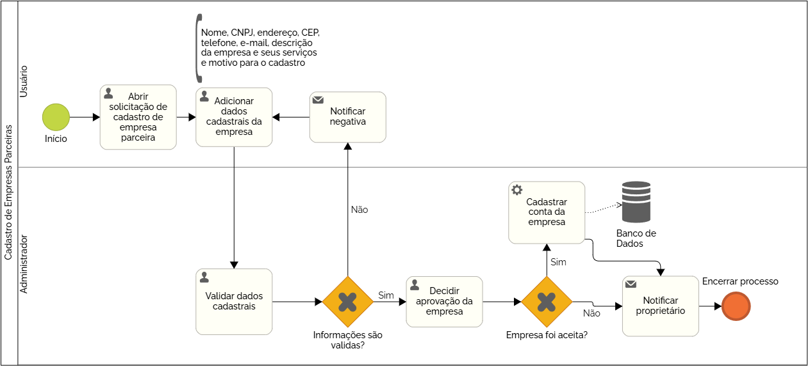

### 3.3.3 Processo 3 – Cadastro de Empresas Parceiras

_Apresente aqui o nome e as oportunidades de melhoria para o processo 1. 
Em seguida, apresente o modelo do processo 1, descrito no padrão BPMN._

#### Detalhamento das atividades

**Atividade 1 - Abrir solicitação de cadastro de empresa parceira**

O processo de Cadastro de Empresas Parceiras se inicia com a empresa indo para a página de "Empresas Parceiras" e então indo para a página de cadastro de empresas parceiras para abrir a solicitação de cadastro

| **Comandos**         |  **Destino**                   | **Tipo** |
| ---                  | ---                            | ---               |
| Ir para “Empresas Parceiras” | Ir para página de empresas parceiras  | Default |
| Ir para “Quero ser uma empresa parceira” | Ir para página de cadastro de empresas  | Default |

**Atividade 2 - Adicionar dados cadastrais da empresa**

O usuário irá preencher e enviar um formulário com os dados cadastrais de sua empresa, que incluem: Nome da empresa, CNPJ, endereço completo, CEP, telefone para contato, e-mail para contato, descrição completa da empresa e serviços oferecidos e motivo para o cadastro, em seguinte ele envia o formulário.

| **Campo**       | **Tipo**         | **Restrições** | **Valor default** |
| ---             | ---              | ---            | ---               |
| Nome da Empresa | Caixa de Texto  | Mínimo 5 caracteres, Máximo 40 caracteres               |                   |
| CNPJ | Caixa de Texto  | Precisamente 14 caracteres, validação automática de CNPJ               |                   |
| Endereço | Caixa de Texto  | Mínimo 20 caracteres, Máximo 60 caracteres               |                   |
| Telefone para contato | Caixa de Texto  | Mínimo 8 caracteres, máximo 20 caracteres, validação automática de telefone               |                   |
| E-Mail para contato | Caixa de Texto  | Máximo 35 caracteres, validação automática de e-mail              |                   |
| Descrição completa da empresa e serviços oferecidos | Área de Texto  | Mínimo 300 caracteres, Máximo 3000 caracteres               |                   |
| Motivo para o cadastro | Área de Texto  | Mínimo 100 caracteres, Máximo 3000 caracteres               |                   |
|                 |                  |                |                   |

| **Comandos**         |  **Destino**                   | **Tipo**          |
| ---                  | ---                            | ---               |
| Enviar formulário | Mensagem para o administrador (Atividade 3) | Default |
|                      |                                |                   |

**Atividade 3 - Validar dados cadastrais**

A plataforma permite a visualização dos dados para que o administrador da plataforma revise as informações do cadastro e determine se eles são dados válidos ou se estão incorretos de alguma forma.

| **Comandos**         |  **Destino**                   | **Tipo**          |
| ---                  | ---                            | ---               |
| Visualizar formulário recebido | Tela de análise de formulário  | Default |
|  

| **Campo**       | **Tipo**         | **Restrições** | **Valor default** |
| ---             | ---              | ---            | ---               |
| Aprovação de Formulário | Seleção Única  | Opções Aprovar ou Reprovar               |                   |
|                 |                  |                |                   |

| **Comandos**         |  **Destino**                   | **Tipo**          |
| ---                  | ---                            | ---               |
| Enviar aprovação | Mensagem de aprovação  | Default |
|                      |                                |                   |

No caso do formulário ser reprovado o usuário irá receber de forma automática uma notificação que diz a respeito da falha do cadastro e terá que informar os dados novamente caso queira se cadastrar como empresa parceira.

**Atividade 4 - Decidir aprovação da empresa**

O administrador irá decidir se a empresa será aceita como uma empresa parceira ou não.
Caso a empresa seja aceita será gerada uma conta da empresa na plataforma de forma automática, ela será notificada a respeito da aceitação do cadastro e o processo terminará.
Caso a empresa não seja aceita, ela será notificada de forma automática a respeito do declínio e o processo terminará.

| **Campo**       | **Tipo**         | **Restrições** | **Valor default** |
| ---             | ---              | ---            | ---               |
| Aprovação da empresa | Seleção Única  | Opções Aprovar ou Reprovar              |                   |
|                 |                  |                |                   |

| **Comandos**         |  **Destino**                   | **Tipo**          |
| ---                  | ---                            | ---               |
| Enviar aprovação | Notificação de aprovação  | Default |
|                      |                                |                   |
