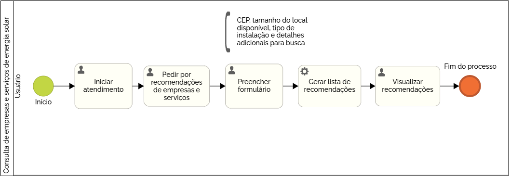

### 3.3.4 Processo 4 – Consulta de Empresas e Serviços de Energia Solar

_Apresente aqui o nome e as oportunidades de melhoria para o processo 2. 
Em seguida, apresente o modelo do processo 2, descrito no padrão BPMN._

#### Detalhamento das atividades

**Atividade 1 - Iniciar atendimento**

O processo de consulta de empresas e serviços de energia solar se inicia com o usuário iniciando um atendimento com o chat automatizado que está disponível através de um botão na plataforma 

| **Comandos**         |  **Destino**                   | **Tipo** |
| ---                  | ---                            | ---               |
| Abrir chat automatizado | Tornar visível chat na tela  | Default |

**Atividade 2 - Pedir por recomendações de empresas ou serviços**

O usuário então irá descrever o problema pedindo por recomendações de empresas e serviços

| **Campo**       | **Tipo**         | **Restrições** | **Valor default** |
| ---             | ---              | ---            | ---               |
| Descrição do problema | Área de Texto  |  Mínimo 15 caracteres, Máximo 500 caracteres              |                   |
|                 |                  |                |                   |

| **Comandos**         |  **Destino**                   | **Tipo**          |
| ---                  | ---                            | ---               |
| Enviar mensagem | Mensagem para o chat automatizado  | Default |
|                      |                                |                   |

**Atividade 3 - Preencher formulário**

O usuário irá então preencher um formulário para que as recomendações possam ser determinadas de acordo com o seu perfil.

| **Campo**       | **Tipo**         | **Restrições** | **Valor default** |
| ---             | ---              | ---            | ---               |
| Qual o seu CEP? | Caixa de Texto  | Mínimo 8 caracteres, Máximo 15 caracteres               |                   |
| Qual o tamanho do local disponível? | Caixa de Texto  | Mínimo 4 caracteres, Máximo 20 caracteres              |                   |
| Qual é o tipo de instalação à procura? | Seleção múltipla  | Opções Residencial, Comercial, Industrial e Rural               |                   |
| Detalhes adicionais | Área de Texto  | Máximo 300 caracteres               |                   |
|                 |                  |                |                   |

| **Comandos**         |  **Destino**                   | **Tipo**          |
| ---                  | ---                            | ---               |
| Enviar mensagem | Mensagem para o chat automatizado  | Default |
|                      |                                |                   |

**Atividade 4 - Visualizar recomendações**

O chat automatizado então irá determinar quais empresas possuem informações cadastradas que melhores coincidem com o perfil do usuário e então irá disponibilizar um botão para que o usuário visualize todas as recomendações e suas informações.

| **Comandos**         |  **Destino**                   | **Tipo**          |
| ---                  | ---                            | ---               |
| Visualizar recomendações | Ir para a lista de recomendações  | Default |
|                      |                                |                   |
